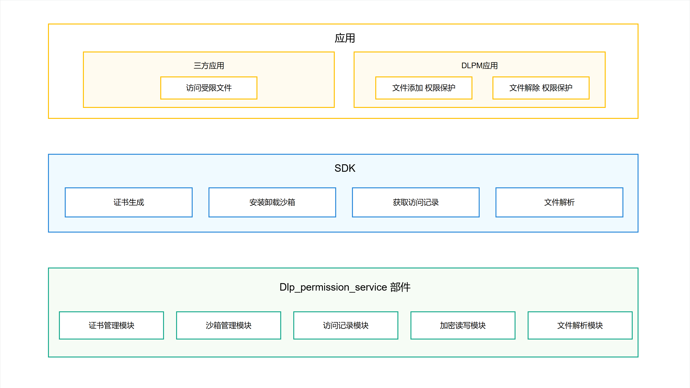

# DLP权限管理部件

## 简介

数据防泄漏（DLP: data_leak_prevention）是通过一系列安全保护技术，实现文档的权限管理功能，保证权限文档的安全性。终端用户给指定文件添加权限保护，给指定终端用户添加只读编辑权限。添加完成后，DLP权限管理部件生成权限保护文件（DLP文件）。权限保护设置完成后，权限保护文件只有指定的终端用户可以打开。

## 架构图

**图 1**   DLP权限管理部件架构图



### DLPM应用：
作为DLP模块的入口应用，提供对原始文件添加权限保护，修改DLP文件权限配置，以及取消DLP文件权限的功能。对原始文件进行加密存储，支持基于账号的访问控制，只有经过授权的终端用户才可以通过系统能力进行访问解密。

### SDK：
向三方应用开发者提供DLP模块的拓展能力，例如获取DLP文件访问记录，DLP沙箱应用保留配置等，优化三方应用在DLP场景的使用体验。

### 主要流程说明：
- 生成DLP文件 ：
    三方应用通过调用startAbility拉起DLP权限应用部件，DLP权限应用部件通过SDK调用DLP权限管理部件，通过证书管理模块和加密读写模块生成对于的DLP文件。
- 打开DLP文件 ：
    三方应用通过调用startAbility拉起DLP权限应用部件，DLP权限应用部件通过SDK调用DLP权限管理部件，通过证书管理模块，加密读写模块，沙箱管理模块拉起沙箱应用对DLP文件进行解密。
- 修改、删除DLP文件权限 ：
    三方应用通过调用startAbility拉起DLP权限应用部件，DLP权限应用部件通过SDK调用DLP权限管理部件，通过证书管理模块和加密读写模块对DLP文件的权限进行修改，或者删除解密生成未加密文件。
- 获取DLP文件访问记录 ：
    三方应用通过SDK调用DLP权限管理部件，通过访问记录模块获取本应用对于DLP文件的访问记录信息。

## 目录

```
/base/security/dlp_permission_service
├── figures                     # README图片存放目录
├── frameworks                  # 框架层，基础功能代码存放目录
│   ├── access_config           # 访问权限配置存放目录
│   ├── common                  # 框架公共代码存放目录
│   ├── dlp_permission          # DLP权限管理框架代码存放目录
│   └── test                    # 框架层测试代码存放目录
├── interfaces                  # 接口层
│   ├── inner_api               # 内部接口层
│   │   ├── dlp_fuse            # link文件及用户态文件系统实现代码存放目录
│   │   ├── dlp_parse           # dlp文件代码存放目录
│   │   └── dlp_permission      # DLP权限管理内部接口代码存放目录
│   └── kits                    # 外部接口层
│       ├── dlp_permission      # DLP权限管理外部接口代码存放目录
│       └── napi_common         # 外部接口公共代码存放目录
├── services                    # 服务层
│   └── dlp_permission          # 服务层代码存放目录
│       └── sa                  # 服务层代码存放目录
│           ├── adapt           # 数据适配相关代码存放目录
│           ├── callback        # 监听回调代码存放目录
│           ├── etc             # 配置文件存放目录
│           ├── sa_common       # 服务层公共代码存放目录
│           ├── sa_main         # DLP权限管理服务代码存放目录
│           ├── sa_profile      # DLP权限管理SA配置文件定义存放目录
│           └── test            # 服务层单元测试代码存放目录
└── test                        # 模糊测试代码存放目录
```

## 部件独立编译命令

./build.sh --product-name rk3568 --build-target dlp_permission_build_module --ccache 

## 使用说明

**使用指导**

## 相关仓

安全子系统

DLP权限管理部件

**security\_dlp\_permission\_service**

